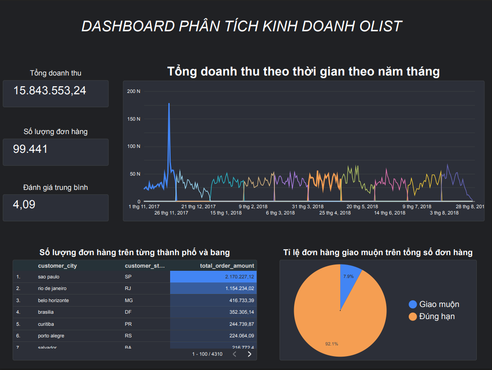

# 📊 Olist E-commerce Data Pipeline & Analysis Dashboard

Dự án xây dựng hệ thống xử lý dữ liệu (Data Pipeline) hoàn chỉnh từ dữ liệu thô (Raw Data) của sàn thương mại điện tử Olist (Brazil) đến Dashboard phân tích kinh doanh chuyên nghiệp.

## 🚀 Tech Stack

* **Data Warehouse:** Google BigQuery  
* **Transformation:** dbt (data build tool)  
* **Orchestration:** Kestra  
* **BI Tool:** Looker Studio  

## 🏗 Kiến trúc hệ thống (Modern Data Stack)

Dự án áp dụng mô hình **Modern Data Stack** để đảm bảo tính tự động hóa, khả năng mở rộng và dễ bảo trì:

1. **Storage Layer**  
   Dữ liệu thô được lưu trữ trên Google BigQuery.

2. **Transformation Layer (dbt)**  
   - Làm sạch dữ liệu  
   - Chuẩn hóa tên cột  
   - Join bảng  
   - Xây dựng Data Marts phục vụ phân tích

3. **Orchestration Layer (Kestra)**  
   - Tự động hóa luồng chạy dữ liệu  
   - Quản lý pipeline  
   - Lập lịch chạy định kỳ  

4. **Visualization Layer (Looker Studio)**  
   Thiết kế Dashboard trực quan với các chỉ số kinh doanh thực tế.

## 📈 Dashboard Insights

Dashboard cung cấp cái nhìn toàn diện về hoạt động kinh doanh của Olist giai đoạn 2016–2018:

* **KPIs chính**
  - Tổng doanh thu (Gross Sales)
  - Số lượng đơn hàng
  - Điểm đánh giá trung bình từ khách hàng

* **Phân tích xu hướng**
  - Theo dõi doanh thu theo tháng
  - Xác định điểm rơi doanh thu (ví dụ: Black Friday)

* **Hiệu suất vận hành**
  - Phân tích tỷ lệ giao hàng muộn (Late Delivery)
  - Đánh giá hiệu quả Logistic

* **Phân tích khách hàng**
  - Doanh thu theo Bang/Thành phố tại Brazil
  - Phân bố đơn hàng theo khu vực địa lý

## 🛠 Cấu trúc dbt Models

### 🔹 Staging
- Làm sạch tên cột  
- Chuẩn hóa kiểu dữ liệu ngày tháng  

### 🔹 Intermediate
- Xây dựng logic tính toán phức tạp  
- Tính cột `is_late_delivery`  
  (So sánh ngày giao thực tế và ngày giao dự kiến)

### 🔹 Marts
- `fct_orders` (Fact Table)
- `dim_customers` (Dimension Table)

Sẵn sàng để sử dụng trên BI Tools hoặc phục vụ phân tích nâng cao.

## 🖼 Dashboard Preview

## 🔗 Liên kết dự án

* **Live Dashboard:**  
https://lookerstudio.google.com/reporting/5a34b54b-220a-46c6-91ea-1a55631972f4

## 🎯 Mục tiêu dự án

- Thực hành xây dựng End-to-End Data Pipeline  
- Ứng dụng Modern Data Stack vào bài toán thực tế  
- Thiết kế Data Model theo chuẩn Analytics Engineering  
- Xây dựng Dashboard phục vụ Business Decision Making
